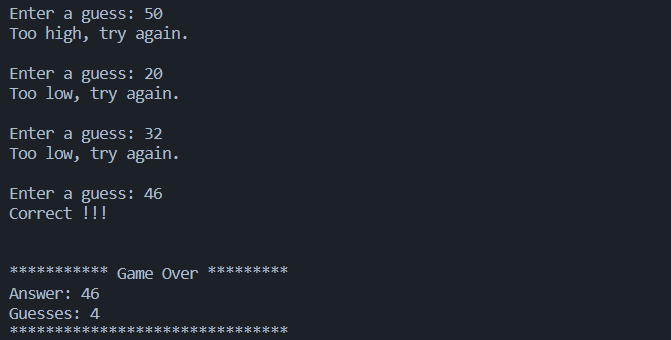

# Number Guessing Game in C
This is a simple C program for a number guessing game. The user has to guess a random number generated by the computer within a limited number of attempts. The program will provide feedback on each guess, letting the user know if the guess was too high or too low. Once the user guesses the number correctly, the game is over and the program will display the number of guesses made.

## How to Use
1. Clone the repository or download the number_guessing_game.c file.
1. Compile the program using a C compiler.
1. Run the compiled program in the terminal or command prompt.
1. Follow the prompts to play the game.

## Technical details:

- The program uses the standard libraries stdio.h, stdlib.h, and time.h.
- The main function initializes three integer variables: guess, guesses, and answer.
- The program generates a random number between 1 and 100 using the srand and rand functions from time.h and stdlib.h libraries.
- The program enters a do-while loop where the user is prompted to enter a guess, and the program checks if the guess is higher or lower than the random number.
- If the guess is higher or lower, the program prints "Too high, try again" or "Too low, try again" respectively.
- If the guess is correct, the program prints "Correct !!!" and exits the loop.
- The program keeps track of the number of guesses and prints the total number of guesses after the game is over.
- The program also prints the randomly generated number at the end of the game.
- The program returns 0 to indicate successful execution.

## Game Output Screenshots 

